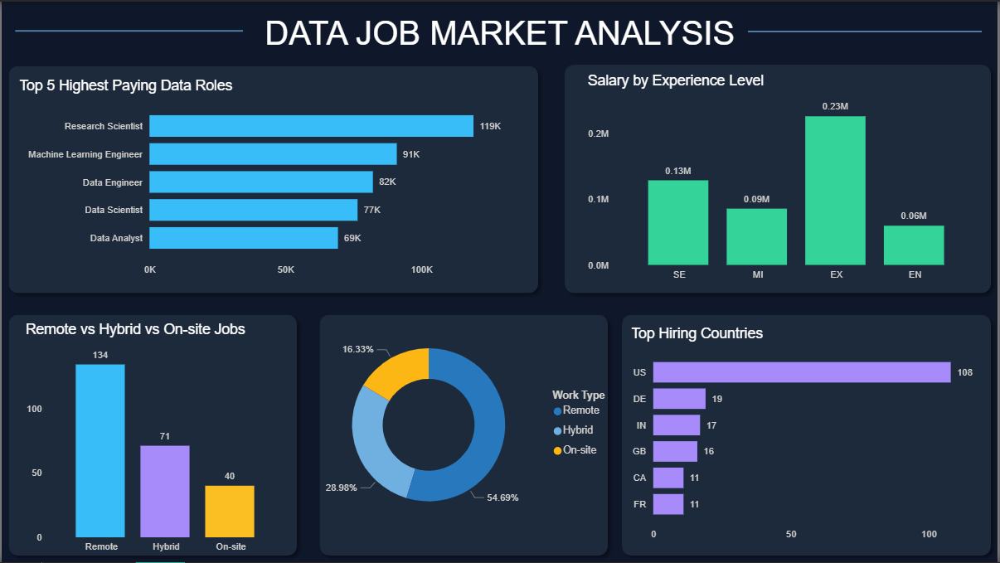

# 💻Data Job Market Analysis Dashboard

## Project Overview

This project analyzes trends in the global data job market using SQL, Python, and Power BI.
The goal of the analysis is to understand salary patterns, hiring trends, and the growing role of remote work in data-related careers.

The dashboard highlights key insights such as the highest-paying data roles, salary growth with experience, remote work distribution, and the countries with the highest demand for data professionals.

---

## Tools Used

* Python (data cleaning and preprocessing)
* PostgreSQL / SQL (data analysis)
* Power BI (data visualization)
* VS Code

---

## Dashboard Preview

---

## Key Insights

* **Research Scientist and Machine Learning Engineer roles have the highest average salaries.**
* **Salary increases significantly with experience**, with executive roles earning nearly four times entry-level salaries.
* **Remote work dominates the data job market**, with a large share of roles offering fully remote opportunities.
* **The United States leads global hiring**, followed by Germany, India, and the United Kingdom.

